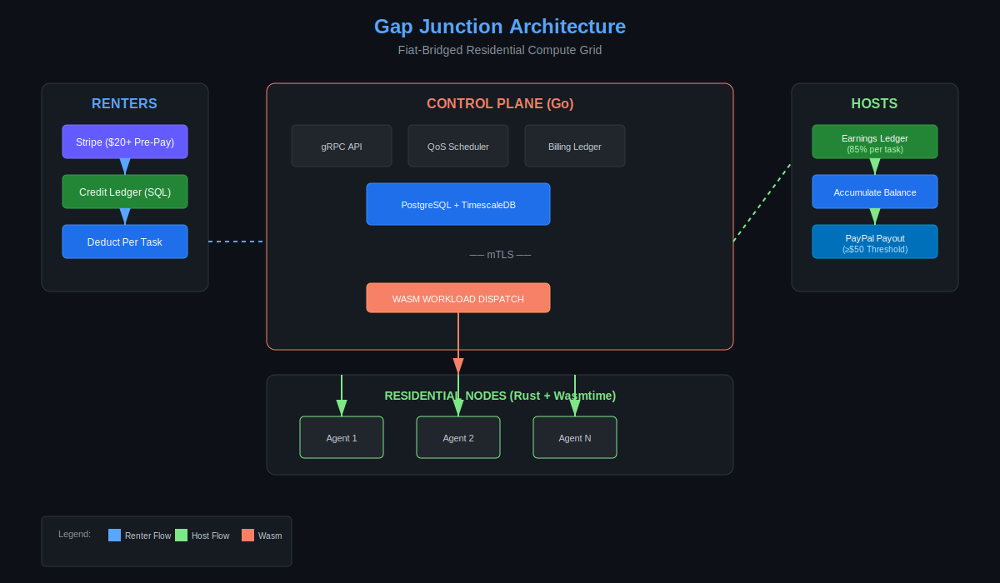

# Gap Junction

> ⚠️ **PROPRIETARY - NOT OPEN SOURCE** ⚠️


---

## 🚨 LEGAL NOTICE

```
╔══════════════════════════════════════════════════════════════════════════════╗
║                                                                              ║
║   THIS REPOSITORY IS A PRIOR ART PUBLICATION — NOT OPEN SOURCE SOFTWARE    ║
║                                                                              ║
║   • You may VIEW this code for educational purposes                         ║
║   • You may NOT use, copy, execute, or modify this code                     ║
║   • You may NOT use this for AI/ML training                                 ║
║   • Violation constitutes COPYRIGHT INFRINGEMENT                            ║
║                                                                              ║
║   See LICENSE file for full terms.                                          ║
║                                                                              ║
╚══════════════════════════════════════════════════════════════════════════════╝
```

---

## 📄 What Is This?

**Defensive Publication: A fiat-bridged residential compute grid using WebAssembly reliability scoring.**

*(Proprietary Research / Prior Art Archive)*

This repository establishes **Prior Art** under 35 U.S.C. § 102 for the following innovations:

| Innovation | Description |
|------------|-------------|
| **Proof-of-Quality (PoQ)** | QoS node ranking with exponential uptime penalty |
| **Aggregation Model** | Pre-paid credits + threshold-based PayPal payouts |
| **Email-Only Routing** | PayPal payouts without storing bank details |

**Publication Timestamp:** January 17, 2026

---

## 🏗️ Architecture Overview

```
RENTER                    CONTROL PLANE                    HOST
  │                            │                             │
  │ Pre-pay $20+ ─────────────►│                             │
  │ (Stripe)                   │                             │
  │                            │                             │
  │ Submit Wasm ──────────────►│                             │
  │                            │ Select node (QoS) ─────────►│
  │                            │                             │
  │                            │◄──────── Execute Wasm ──────│
  │                            │◄──────── Report fuel ───────│
  │                            │                             │
  │ Deduct credits ◄───────────│───────► Credit 85% ────────►│
  │ (SQL ledger)               │         (SQL ledger)        │
  │                            │                             │
  │                            │ Payout when ≥ $50 ─────────►│
  │                            │ (PayPal)                    │
```



---

## 📚 Documentation

| Document | Description |
|----------|-------------|
| [whitepaper.md](./whitepaper.md) | **The Invention** — Full technical specification |
| [architecture.svg](./architecture.svg) | System diagram |
| [API Specification](./api/) | Protocol Buffer definitions |

---

## 🔬 Prior Art Claims

This publication establishes prior art for:

### 1. QoS Scoring Function (Section 4.2)
```
U(n) = 0.30·S_uptime + 0.20·S_latency + 0.20·S_consistency + 0.15·S_capacity + 0.15·S_reliability
```

With exponential uptime penalty:
```
S_uptime = (uptime/90)³  if uptime < 90%
```

### 2. Aggregation Model (Section 5.1)
- Renter pre-pay: $20.00 minimum
- Host payout threshold: $50.00 minimum
- Platform fee: 15%
- NO per-transaction payment calls

### 3. Email-Only Payout Routing (Section 5.4)
- Store PayPal email only
- No bank account numbers
- No PCI-DSS compliance burden

---

## ⚖️ License

**PROPRIETARY — ALL RIGHTS RESERVED**

This is NOT open source software. See [LICENSE](./LICENSE) for terms.

```
Copyright (c) 2026 Angizmart. All rights reserved.

No license is granted to use, copy, modify, or distribute this software.
This repository exists solely to establish Prior Art.
```

---

## 📧 Contact

For licensing inquiries: [Your Email]

---

<p align="center">
  <em>Gap Junction — Prior Art Publication</em><br>
  <em>Published: January 17, 2026</em>
</p>
