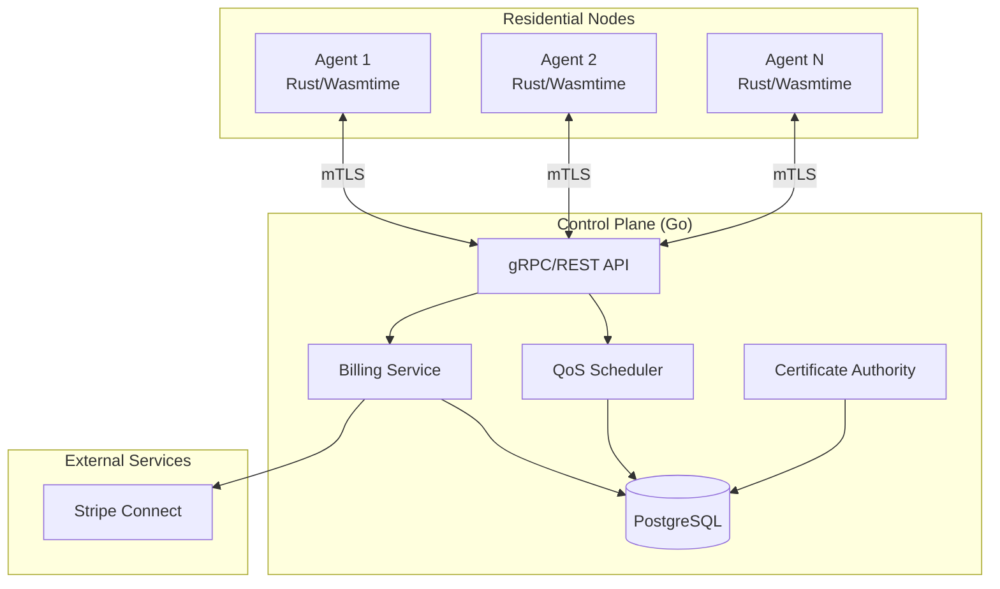
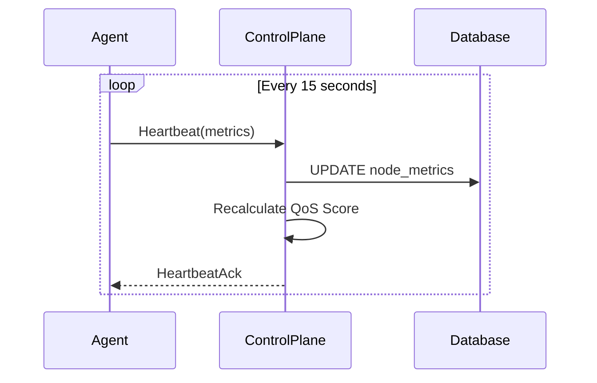
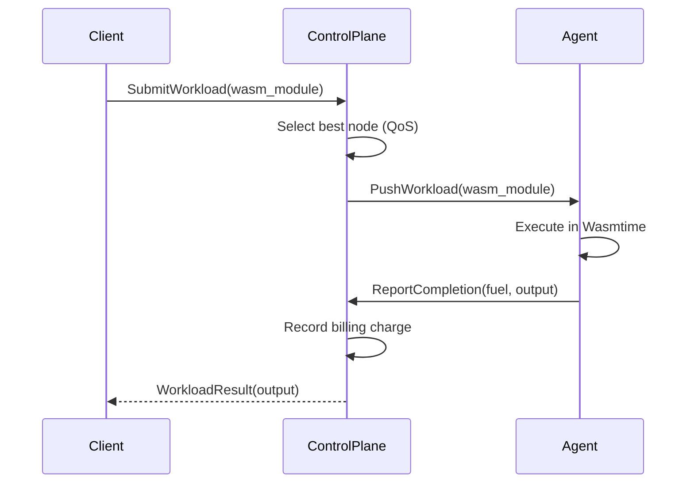

# 2. System Architecture

## 2.1 High-Level Overview

Gap Junction follows a **Hierarchical Star Topology** with three primary components:

1. **Control Plane** (Go): Central coordinator for scheduling, billing, and identity.
2. **Host Agents** (Rust): Residential nodes running Wasm workloads.
3. **Data Layer** (PostgreSQL + TimescaleDB): Persistent storage for metrics and billing.



## 2.2 Component Responsibilities

### 2.2.1 Control Plane

| Component | Responsibility |
|-----------|---------------|
| gRPC API | Agent communication (heartbeats, workload dispatch) |
| REST API | Client submission, admin operations, webhooks |
| QoS Scheduler | Node ranking, workload assignment |
| Billing Service | Ledger management, Stripe payouts |
| Certificate Authority | mTLS certificate issuance |

### 2.2.2 Host Agent

| Component | Responsibility |
|-----------|---------------|
| Wasmtime Runtime | Execute Wasm modules with resource caps |
| Metrics Collector | System telemetry (CPU, memory, latency) |
| gRPC Client | Heartbeat, workload receipt, completion reporting |
| Identity Module | Certificate management, mTLS bootstrap |

## 2.3 Communication Patterns

### 2.3.1 Heartbeat (Push)

Agents push telemetry to the Control Plane at regular intervals:



### 2.3.2 Workload Dispatch (Server Push)

Workloads are pushed from Control Plane to Agents:



## 2.4 Data Flow

### 2.4.1 Telemetry Pipeline

```
Agent → Heartbeat → Control Plane → TimescaleDB → QoS Calculation
                                           ↓
                                    30-day Aggregates
                                           ↓
                                    Uptime %, Latency σ
```

### 2.4.2 Billing Pipeline

```
Task Completion → Fuel Report → Ledger Entry → Batch Aggregation → Stripe Transfer
     ↓                ↓              ↓               ↓                   ↓
  Agent           Controller      PostgreSQL      Scheduler          Stripe API
```

## 2.5 Deployment Architecture

### 2.5.1 Control Plane (Cloud)

- **Compute:** Kubernetes cluster (3+ nodes for HA)
- **Database:** Managed PostgreSQL with TimescaleDB extension
- **Networking:** Load balancer with TLS termination
- **Secrets:** HashiCorp Vault or cloud KMS

### 2.5.2 Host Agent (Residential)

- **Compute:** User's PC (Windows, macOS, Linux)
- **Runtime:** Single binary with embedded Wasmtime
- **Networking:** Outbound-only (no port forwarding required)
- **Updates:** Self-updating via signed binaries

## 2.6 Technology Choices

| Layer | Technology | Justification |
|-------|------------|---------------|
| Agent Language | Rust | Memory safety, Wasmtime native integration |
| Agent Runtime | Wasmtime | Bytecode Alliance, WASI 0.2 support |
| Controller Language | Go | Concurrency model, ecosystem maturity |
| Database | PostgreSQL | ACID compliance, TimescaleDB for metrics |
| Time-Series | TimescaleDB | Native PostgreSQL extension, hypetables |
| gRPC | Protocol Buffers | Efficient serialization, streaming support |
| Payments | Stripe Connect | Global coverage, instant payouts, compliance |
