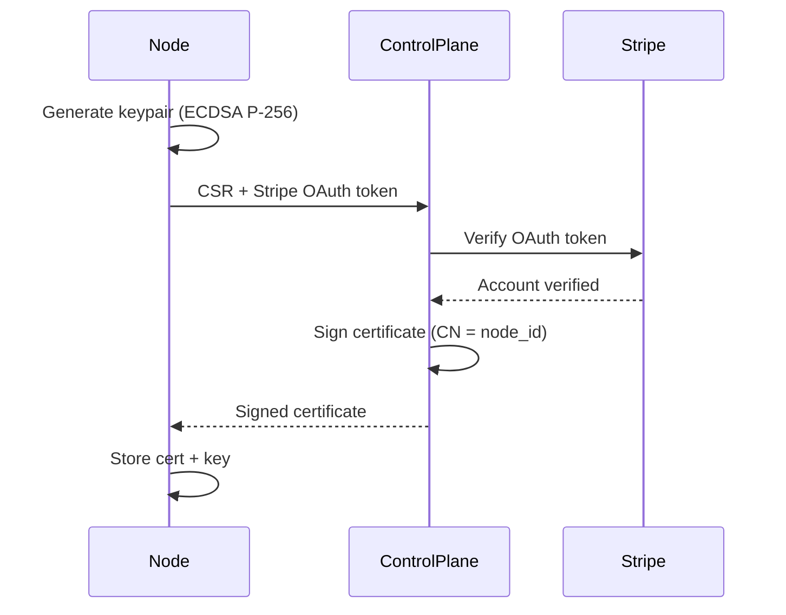

# 3. Security Model

## 3.1 Zero-Trust Architecture

**IP-CRITICAL SECTION**

Gap Junction operates on a **Zero-Trust** security model where:
1. No actor (agent, client, or admin) is implicitly trusted.
2. Every request is authenticated and authorized.
3. All data in transit is encrypted (mTLS).
4. Workloads are isolated in capability-based sandboxes.

### 3.1.1 Stripe-Bound Identity

**NOVELTY CLAIM:** Binding cryptographic identity to verified Stripe Connect accounts.

The identity bootstrap process:



**Security Properties:**
- **Sybil Resistance:** Creating fake nodes requires verified Stripe accounts.
- **Accountability:** Malicious nodes can have payouts frozen.
- **Auditability:** Certificate CN maps 1:1 to Stripe account.

### 3.1.2 mTLS Requirements

All Agent ↔ Control Plane communication requires:
- **Client Certificate:** Agent presents its signed certificate.
- **Server Certificate:** Control Plane presents its certificate.
- **CA Verification:** Both sides verify against the Gap Junction CA.

## 3.2 Heartbeat Protocol

### 3.2.1 Anti-Replay Protection

Each heartbeat includes:
- **Timestamp:** Unix milliseconds (must be within 60s of server time).
- **Nonce:** Random 16-byte value (prevents replay within time window).
- **Signature:** HMAC-SHA256 over (timestamp || nonce || metrics).

### 3.2.2 Jitter Algorithm

To prevent thundering herd on Control Plane:

```
base_interval = 15 seconds
jitter_range = base_interval * 0.1  // ±10%
actual_interval = base_interval + random(-jitter_range, +jitter_range)
```

This spreads heartbeats uniformly across the interval window.

## 3.3 Wasm Sandbox Security

### 3.3.1 Wasmtime Capabilities

Guest Wasm modules run with **capability-based security**:

| Capability | Default | Justification |
|------------|---------|---------------|
| Filesystem | Denied | No host FS access |
| Network | Denied | No raw sockets |
| Environment | Denied | No env var access |
| Clock | Read-only | Monotonic only |
| Random | Allowed | WASI random_get |
| Stdout/Stderr | Allowed* | Debug mode only |

### 3.3.2 Resource Caps

**IP-CRITICAL:** Epoch-based CPU interruption combined with fuel counting.

| Resource | Limit | Enforcement |
|----------|-------|-------------|
| Memory | 256 MB (configurable) | Wasmtime ResourceLimiter |
| CPU Time | 30 seconds (configurable) | Epoch interruption |
| Instructions | 10 billion fuel | Fuel consumption |

### 3.3.3 Fuel-Based Billing

Every Wasm instruction consumes "fuel":
- **Billing Granularity:** Instruction-level metering.
- **DoS Prevention:** Infinite loops exhaust fuel.
- **Predictable Costs:** Fuel → cents conversion is deterministic.

## 3.4 Resource Capping Implementation

**NOVELTY CLAIM:** Combining epoch interruption with fuel metering for dual-purpose (security + billing).

```rust
// Wasmtime configuration
config.epoch_interruption(true);  // Wall-clock timeout
config.consume_fuel(true);         // Instruction counting

// Per-execution limits
store.set_epoch_deadline(3000);   // 30s at 10ms epochs
store.set_fuel(10_000_000_000);   // 10B instructions
```

**Epoch Interruption:**
- Wasmtime increments an "epoch" counter every ~10ms.
- Each Store has a deadline measured in epochs.
- Exceeding the deadline traps the execution.

**Fuel Consumption:**
- Each instruction decrements the fuel counter.
- Zero fuel traps the execution.
- Remaining fuel is subtracted from initial to calculate consumed.

## 3.5 Threat Model

### 3.5.1 Threat Actors

| Actor | Capability | Mitigation |
|-------|------------|------------|
| Malicious Node | Execute arbitrary code on own machine | Affects only themselves; payouts frozen on reports |
| Malicious Client | Submit malicious Wasm modules | Sandbox prevents host access; fuel limits DoS |
| Network Attacker | MITM, replay | mTLS prevents MITM; nonces prevent replay |
| Control Plane Compromise | Full system access | Defense in depth; secrets in Vault; audit logs |

### 3.5.2 Attack Scenarios

| Attack | Detection | Response |
|--------|-----------|----------|
| Sybil Attack | Stripe account verification | Require verified Connect accounts |
| Resource Exhaustion | Fuel tracking | Terminate at fuel limit |
| Heartbeat Spoofing | mTLS + certificate CN | Reject invalid certificates |
| Billing Fraud | Cryptographic task IDs | Reconcile fuel with execution proofs |

## 3.6 Compliance Considerations

### 3.6.1 Data Handling

- **PII:** Only Stripe account IDs stored (Stripe handles PII).
- **Workload Data:** Ephemeral; cleared after execution.
- **Metrics:** Aggregated; no individual user tracking.

### 3.6.2 Financial Compliance

- **Money Transmission:** Stripe is the licensed transmitter.
- **Tax Reporting:** Stripe issues 1099-K to node operators.
- **AML/KYC:** Stripe handles verification for Connect accounts.
